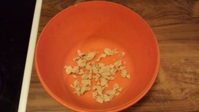
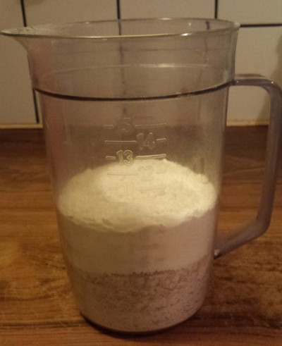
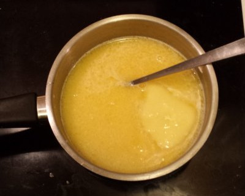
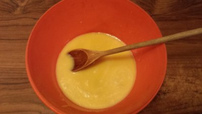
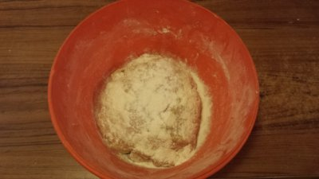
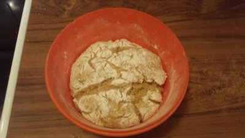
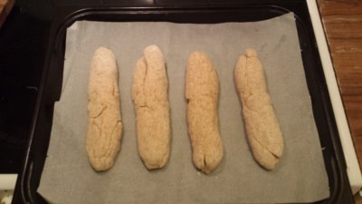
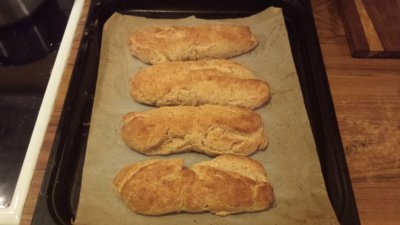

# graham bread

For hungry programmers that `require()` something more than shitty mass produced bread.

## dependencies

* 3 deciliters of milk
* 50 grams of yeast
* 50 grams of butter
* 0.5 deciliters of syrup
* 0.5 teaspoon of salt
* 5 deciliters of graham flour
* 3.5 deciliters of wheat flour

## install

Put the yeast in a bowl and break it up into smaller pieces.

Prepare by measuring the flour. Stir with a spoon to mix the two sorts of flour together.

Pour the milk in a skillet together with butter, syrup and salt and heat it to 37°C (body temperature). It's important that it doesn't get too hot because that would kill the yeast.

Pour the milk mixture over the yeast and stir until the yeast has dissolved. This will make the yeast very happy and it will immediately start munching on the food producing carbon dioxide for us.

Gradually pour the flour into the bowl and stir. After a while you'll have a dough that will look something like below.

Put a towel on top of the bowl and let it rest for 40 minutes. The dough will rise to about the twice the previous size.

Take out the dough and knead it. Here you have a few options on how to shape the bread. You can make smaller buns (about 15), smaller loafs (about 4) or larger loafs (one to two). Up to you. Once you are done put the buns on a plate. You can butter the plate or use oven paper like I did.

Put the towel back on top of the buns, turn on the oven and set it to 225°C. Let the buns rest for another 30 to 40 minutes. Put them in the middle of the oven for 12 to 15 minutes. Make sure to wet the bread if you want to have a crust. Also this will help the bread to not burn as easily.

Enjoy!

## usage

Cut to preferred chunks. Shit load of butter, marmelade, cheese or whatever you like with your bread. For more advanced usage you can put sesame or sunflower seeds on the bread before you bake it. Make sure to wet the bread with some water so the seeds stick.

## license
[CC0](https://creativecommons.org/publicdomain/zero/1.0/)